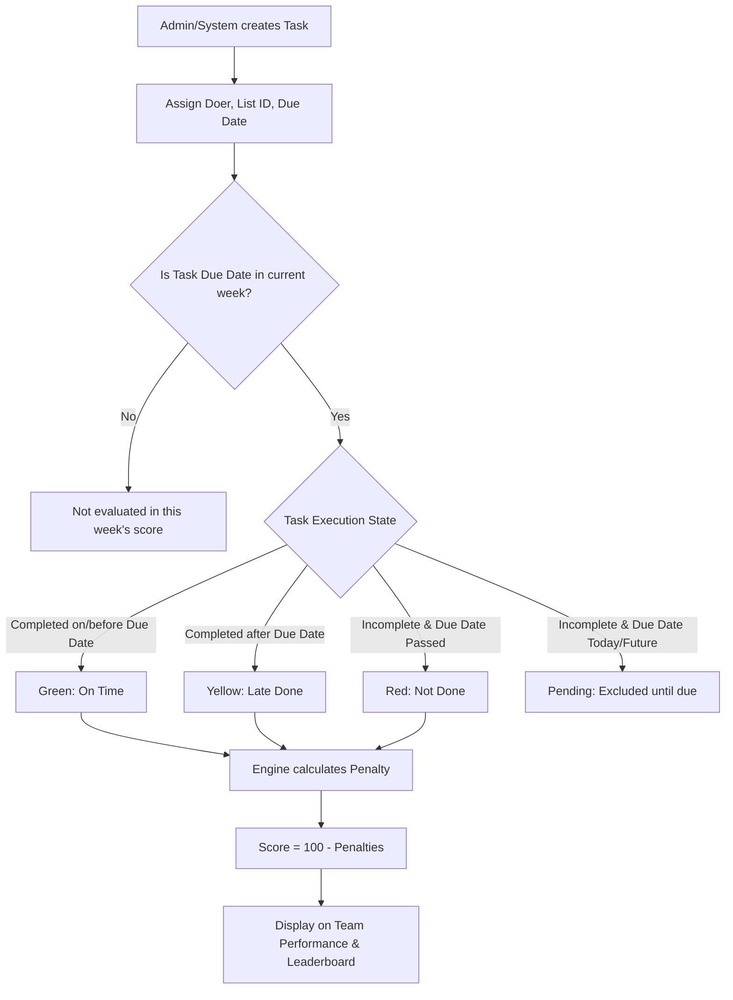

# 📊 DGMAX Performance Scoring & System Workflow Documentation

This document explains the complete working methodology of the **DGMAX Negative Performance Scoring System**, task categorization rules, scoring calculations, and system workflows (including Login & Auth).

---

## 🎯 1. Core Concept of DGMAX Scoring

In traditional systems, employees earn points for completing tasks. Under the **DGMAX Negative Performance Scoring System**:
- **Every employee starts each week clean at 100 points (or 0 Penalty).**
- There are **no bonus points**; completing work on time simply protects your score.
- Only **delays (Late Done)** and **incomplete work past due date (Not Done)** pull the score down.
- **Checklist items are excluded**: Routine recurring checklist items are excluded from scoring. Only **Task List** items are evaluated for performance.

---

## 🏷️ 2. Task Categorization Rules

For any given task in the system, its status relative to the due date determines its category:

| Category | Status Name | Color | Condition | Impact on Score |
| :--- | :--- | :--- | :--- | :--- |
| **Green** | **On Time** | 🟢 Green | Completed on or before the due date (`updatedAt <= dueDate`). | **0 Penalty** (No reduction) |
| **Yellow** | **Late Done** | 🟡 Yellow | Completed after the due date (`updatedAt > dueDate`). | **Partial Penalty** (Weighted) |
| **Red** | **Not Done** | 🔴 Red | Still incomplete, and the due date has already passed (`dueDate < today`). | **Full Penalty** (100% per task) |
| **Pending** | **Pending** | ⚪ Neutral | Incomplete, but the due date is today or in the future (`dueDate >= today`). | **Excluded** (Not yet scoreable) |
| **Exempt** | **Cancelled / No Due Date** | — | Status is `Cancelled` or `dueDate` is empty. | **Excluded** (Not counted) |

---

## 📐 3. Mathematical Formulas

The performance scoring engine (`backend/src/utils/performanceScoring.ts`) executes the following single source of truth calculations:

### Step A: Total Assigned Tasks
$$\text{Assigned Tasks} = \text{Green (On Time)} + \text{Yellow (Late Done)} + \text{Red (Not Done)}$$
*(Note: Pending, Cancelled, and Checklist tasks are excluded from Assigned Tasks)*

### Step B: Weight per Task
$$\text{Per Task \%} = \frac{100}{\text{Assigned Tasks}}$$

### Step C: Penalty Calculation
1. **Not Done Penalty (Full Penalty):**
   $$\text{Not Done Penalty} = \text{Red Count} \times \text{Per Task \%}$$

2. **Late Done Penalty (Weighted Penalty):**
   $$\text{Late Done Penalty} = \text{Yellow Count} \times \text{Per Task \%} \times \left( \frac{\text{Late Done Weight}}{100} \right)$$
   *(Default `Late Done Weight` = **60%**, configurable by Admin)*

3. **Negative Score (Final Score, 0 to -100):**
   $$\text{Negative Score} = -\min\left(100, \text{Not Done Penalty} + \text{Late DonePenalty}\right)$$

4. **Performance Score (0 to 100 Scale):**
   $$\text{Performance Score} = 100 + \text{Negative Score}$$

---

## 💡 4. Real-World Calculation Example

Suppose an employee has **5 assigned tasks** for the week, and `Late Done Weight = 60%`:

$$\text{Per Task \%} = \frac{100}{5} = 20\%$$

- 🟢 **3 Tasks On Time (Green)** → 0 penalty
- 🟡 **1 Task Late Done (Yellow)** → $1 \times 20\% \times 60\% = 12\%$ penalty
- 🔴 **1 Task Not Done (Red)** → $1 \times 20\% \times 100\% = 20\%$ penalty

$$\text{Total Penalty} = 12\% + 20\% = 32\%$$
$$\text{Negative Score} = -32.00$$
$$\text{Performance Score} = 100 - 32 = 68.00 \quad (\text{Orange Status})$$

---

## 🔄 5. Complete End-to-End Workflow

---

## 🔐 6. Authentication & User Login Workflow

### Login Process
1. **Identifier & Password:** User submits `identifier` (Email OR Employee Code e.g. `TM01`, `AD01`) + `password`.
2. **Backend Authentication (`/api/auth/login`):**
   - Lookup doer record in `DOERLIST`.
   - Verify hashed password using `bcrypt.compare`.
   - Issue JWT cookie / Auth Token containing `sub` (User ID), `role` (`Admin` | `Doer`), `canViewAll`, `isAssistant`, `isAttendanceManager`.
3. **Role & Access Permissions:**
   - **Admin:** Full access to Settings, Team Performance, All Tasks, IMS, and Workflows.
   - **Assistant Admin:** Full Admin access except destructive actions (deleting users/tasks).
   - **Doer:** Access restricted to assigned tasks, assigned lists (`memberIds`), attendance, and active workflows.
